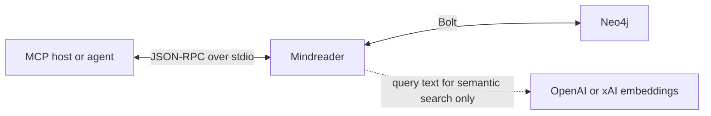

# mindreader

[](https://crates.io/crates/mindreader)
[](https://github.com/bnomei/mindreader/actions/workflows/ci.yml)
[](https://www.npmjs.com/package/@bnomei/mindreader)
[](LICENSE)
[](https://discordapp.com/users/bnomei)
[](https://www.buymeacoffee.com/bnomei)

Mindreader is a deterministic [Model Context Protocol (MCP)](https://modelcontextprotocol.io/) memory server backed by Neo4j. It stores explicit graph triples (`subject -predicate-> object`) and serves exactly eight tools over stdio.

The agent is the clerk of the graph. A fact exists only after a tool writes it. Later tools paste the handles they were given. Mindreader does not extract memory from conversation with a hidden language model, and it does not expose raw Cypher.

Ordinary writes are set-valued and record an `Episode` when anything changes. Explicit corrections close the selected old fact and link its replacement with `SUPERSEDES`. Closed-world `memory_recall` stays inside Neo4j. Optional `memory_recall_semantic` sends only its query text to the configured OpenAI or xAI embedding API.

That is a different contract from chat-memory extractors such as [Graphiti](https://arxiv.org/abs/2501.13956): those systems ingest messages and derive facts automatically. Mindreader records only what an agent asserts, then returns pasteable identifiers for the next call rather than a prose context blob.

## Start here

| Goal | Read |
| --- | --- |
| Install a packaged binary | [Install a release](#install-a-release) |
| Build and verify Mindreader with a disposable Neo4j database | [Quickstart from source](#quickstart-from-source) |
| Add Mindreader to an MCP host | [Connect an MCP client](#connect-an-mcp-client) |
| Teach an agent the recall → paste → mutate loop | [Agent loop](#agent-loop) |
| Look up exact inputs, defaults, and limits | [MCP tool reference](#mcp-tool-reference) |
| Understand layers, ranking, semantic recall, and history | [Memory model](#memory-model) |
| Configure Neo4j, embeddings, and semantic recall | [Configuration reference](#configuration-reference) |
| Develop or validate the project | [Development](#development) |

## What mindreader provides

- Explicit triples in a shared Neo4j graph. No hidden extractor, no silent overwrite, no raw Cypher.
- Eight job-shaped tools: closed-world recall, optional semantic recall, write, revise, withdraw, judge, place, and unify.
- Pasteable `target` handles on nodes and facts so the next tool call copies identity instead of inventing it.
- Request-scoped layer visibility (`scope`). `[]` is global-only, not all memory. Layers are a flashlight, not an ACL.
- RDFS schema-as-data: Class and Property nodes live in the graph and are listed with `memory_recall` `labels`.
- Set-valued current facts, explicit `SUPERSEDES` corrections, optional `CONTRADICTS` links, and soft withdrawal (`validTo`).
- Advisory `review.unify` / `review.alternatives` queues. Merges and corrections stay intentional.
- Shared signed weights changed only by `memory_judge`. Retrieval never updates rank by itself.
- Spike categories ranked `Knowledge > Insight > Pattern > Signal`, then weight, then text.
- A stdio MCP server that completes the handshake before Neo4j is ready and connects lazily.

## Architecture and data boundary



The MCP host owns process access and authentication. Mindreader owns tool validation, graph behavior, and provenance. Neo4j stores durable graph records and expiring semantic activations. The embedding provider receives query text only when an agent calls `memory_recall_semantic`; it does not receive stored result bundles.

## Install a release

Choose one installation method. GitHub Release assets cover x64 and arm64 GNU/glibc and musl Linux, x64 and arm64 macOS, and x64 Windows. The npm launcher supports the GNU/glibc, macOS, and Windows assets and requires Node.js 18 or newer. On first use it downloads the matching binary, verifies its SHA-256 checksum, and stores it in a versioned cache.

### npm launcher

```bash
npx -y @bnomei/mindreader@latest --version
```

Pin the package version in MCP configuration so the host starts the same Mindreader release each time. The launcher honors `MINDREADER_VERSION`, `MINDREADER_REPOSITORY`, and `MINDREADER_NPM_CACHE` for version, mirror, and cache overrides.

### Direct installer

GNU Linux and macOS users can install the latest release:

```bash
curl -fsSL https://raw.githubusercontent.com/bnomei/mindreader/main/scripts/install.sh | sh
```

### Cargo

With [cargo-binstall](https://github.com/cargo-bins/cargo-binstall), install the matching prebuilt GitHub Release binary without compiling Mindreader:

```bash
cargo binstall mindreader
```

If `cargo binstall` is not available yet, install it first:

```bash
cargo install cargo-binstall --locked
cargo binstall mindreader
```

To build the published crate from source with Rust 1.89 or newer:

```bash
cargo install mindreader --locked
```

Both Cargo paths install the `mindreader` executable into Cargo's binary directory, normally `$HOME/.cargo/bin`.

Verify a native installation:

```bash
mindreader --version
```

Expected output for this release:

```text
mindreader <version>
```

### Release artifacts

Checksummed archives are available from [GitHub Releases](https://github.com/bnomei/mindreader/releases). Static musl archives for x64 and arm64 Linux are available as manual downloads. The release container is published to GHCR:

```bash
docker run --rm ghcr.io/bnomei/mindreader:latest --version
```

## Quickstart from source

This path runs Neo4j in Docker, verifies the graph behavior, and builds a local MCP server binary.

### Prerequisites

- Docker with Docker Compose. Neo4j must provide matching APOC Core and APOC Extended plugins; the included Compose service installs both.
- Rust 1.89 or newer with Cargo

### 1. Configure the server

```bash
cp .env.example .env
```

Set a private `NEO4J_PASSWORD` in `.env`. The example password is intended only for local development.
This repository-level file supplies Docker Compose. A native Mindreader process instead uses its OS configuration directory, described in [Configuration reference](#configuration-reference).

### 2. Start Neo4j

```bash
docker compose up -d neo4j
```

Neo4j listens on `bolt://127.0.0.1:7687`; its browser UI is available at `http://127.0.0.1:7474`.
Mindreader does not migrate older graph models. Recreate a disposable local volume with `docker compose down --volumes` only when Mindreader reports that the database is unversioned, non-empty, or incompatible. This command permanently deletes that Compose volume.

### 3. Verify the memory behavior

```bash
docker compose --profile tools up -d neo4j-tools
NEO4J_PASSWORD='<same-password-as-repository-.env>' cargo run --features developer-tools --bin mindreader-smoke -- --config-dir packaging/tools-config
```

The smoke process reads secrets from `packaging/tools-config` (Bolt 7688) so it cannot rewrite a live MCP embedding space on 7687. Process `NEO4J_PASSWORD` still wins over the colocated `.env`.

The smoke test creates test graph data and exercises catalog creation, dynamic multi-layer visibility, membership merging, scoped revision and withdrawal, signed judgment ranking, concurrent judgments, membership auditing, endpoint closure, and stable fact-handle retrieval. A successful run ends with:

```text
ALL PASS
```

Important: the smoke binary persists its fixtures and does not clean them up. Run it only against a development or disposable Neo4j database.

### 4. Build the MCP server

```bash
cargo build --release --bin mindreader
```

The executable is `target/release/mindreader`. Add it to an MCP client using the [client configuration](#connect-an-mcp-client) below.

Run the binary without arguments to serve MCP. It also accepts `-h`/`--help` and `-V`/`--version`; other arguments are rejected.

## Connect an MCP client

Mindreader uses stdio transport and supports only MCP `2026-07-28`, including the discovery lifecycle and self-contained request metadata. Older initialization protocols are rejected rather than downgraded. The MCP client starts the process and exchanges JSON-RPC messages over its standard input and output. Configure one of the launch methods below, restart the client, and verify that it lists all eight tools in the [MCP tool reference](#mcp-tool-reference).

### Local binary

Use absolute paths because desktop MCP clients do not necessarily inherit your shell's working directory or `PATH`.

```json
{
  "mcpServers": {
    "mindreader": {
      "command": "/absolute/path/to/mindreader/target/release/mindreader",
      "env": {
        "NEO4J_PASSWORD": "<NEO4J_PASSWORD>",
        "OPENAI_API_KEY": "<OPTIONAL_OPENAI_API_KEY>"
      }
    }
  }
}
```

Configure the Neo4j URI, username, provider models, and semantic-search policy in the native [`config.toml`](#configuration-reference), not in MCP environment variables. Keep only secrets in the `env` block or native `.env` file.

### npm launcher

Pin the package version in MCP configuration so the client always starts the same release:

```json
{
  "mcpServers": {
    "mindreader": {
      "command": "npx",
      "args": ["-y", "@bnomei/mindreader@0.5.0"],
      "env": {
        "NEO4J_PASSWORD": "<NEO4J_PASSWORD>",
        "XAI_API_KEY": "<OPTIONAL_XAI_API_KEY>"
      }
    }
  }
}
```

### Docker Compose

The Compose service builds and runs Mindreader while Neo4j uses the persistent `neo4j-data` volume.

```json
{
  "mcpServers": {
    "mindreader": {
      "command": "docker",
      "args": [
        "compose",
        "-f",
        "/absolute/path/to/mindreader/docker-compose.yml",
        "run",
        "--rm",
        "-T",
        "mindreader"
      ],
      "cwd": "/absolute/path/to/mindreader"
    }
  }
}
```

Run `docker compose up -d neo4j` before the client launches the Compose-backed server. Compose reads the repository's `.env` file.

## Agent loop

Most tasks need one recall and no mutation. A durable update usually needs one targeted recall and one batched mutation. The eight tools are verbs, not a checklist.

1. Choose the narrowest `scope` that should see the work and copy it on later scoped calls. There is no session default. `[]` means global records only.
2. Reuse node IRIs and fact `target` handles you already have. Otherwise call `memory_recall` with exactly one selector:

   | Need | Selector |
   | --- | --- |
   | Names or terms | `text` |
   | Known node IRIs | `iris` (`hops` defaults to `0`; incident fact handles still appear on `lookups[i].facts` and `handles.facts`. Use `1` to also fill top-level `facts[]`) |
   | Class or Property catalog | `labels: ["Class"]` or `["Property"]` |
   | Neighborhood from a node | `around`, optional `p` and `depth` |
   | Current plus historical facts | `history` (one node or fact IRI) |

   Call `memory_recall_semantic` only when lexical recall is not enough and sending the query text to the embedding provider is acceptable. Both recall tools accept `detail`: `detailed` (default) or `concise`.
3. If nothing durable should change, stop.
4. If something should change, pick the smallest verb:

   | Situation | Tool |
   | --- | --- |
   | Same `(s, p, o)`, maybe another layer | `memory_write` (merge or no-op) |
   | Another valid object for the same pair | `memory_write` |
   | This object is wrong; replacement known | `memory_revise` (paste the fact `target`) |
   | This object is stale; no replacement | `memory_withdraw` |
   | Membership only | `memory_place` (`scope` is visibility; `add` / `remove` is the change) |
   | Two nodes are the same identity | `memory_unify` after you choose the survivor |

5. Paste returned handles. Every success result includes `handles` (`facts`, `nodes`, `current`, `retired`, `unify`). Do not reconstruct `mindreader:relationship/<uuid>`. Do not treat a fuzzy name hit as identity.
6. `review.unify` and `review.alternatives` are queues, not commands. Judge only retrievals that actually helped or hurt (`rateable: true`).

Text and semantic recall also fill `nodes[]` from returned fact endpoints. `iris` reports misses as `lookups[i].found: false`. After `memory_revise`, the live handle is `target` / `handles.current`; `previousTarget` / `handles.retired` is the retired input. `memory_unify` takes `{kind:"node", iri}` handles; paste `review.unify[].source` and `.target`, or `handles.unify[]`.

A global fact can appear under a named `scope` with `mutable: false`. Revise or withdraw it with `scope: []`. The error says so.

Keep task chatter, acknowledgements, markdown dumps, and transient status in the conversation. Store identities, durable relationships, decisions that constrain later work, and explicit contention that should stay visible. The reusable agent guide is [`skills/using-mindreader/SKILL.md`](skills/using-mindreader/SKILL.md).

## Minimal write, recall, and walk example

### Write one durable fact

Call `memory_write` with `facts[]` and an explicit visibility scope:

```json
{
  "facts": [
    {
      "s": { "kind": "node", "name": "Alice" },
      "p": "worksOn",
      "o": { "kind": "node", "name": "mindreader" }
    }
  ],
  "scope": ["project:graph-memory"]
}
```

The response includes one Episode when any fact changed, plus per-item pasteable `target` handles.

### Recall by text

Call `memory_recall` with the same scope, or a broader OR union:

```json
{
  "text": "Alice",
  "scope": ["project:graph-memory", "project:agent-runtime"]
}
```

Each fact includes a `target` you can pass to `memory_revise`, `memory_withdraw`, `memory_judge`, or `memory_place`.

For conceptual recall, use the separate provider-backed tool:

```json
{
  "text": "graph memories about agent coordination",
  "labels": ["Insight", "Knowledge"],
  "limit": 20,
  "scope": ["project:graph-memory"]
}
```

This is an input to `memory_recall_semantic`. Ordinary `memory_recall` never sends text outside Neo4j.

### Walk from a returned IRI

Call `memory_recall` with `around` and optional predicate names:

```json
{
  "around": "mindreader:element/alice",
  "p": ["worksOn"],
  "depth": 2,
  "scope": ["project:graph-memory"]
}
```

For `around`, `paths[i]` is the deterministic shortest witness path for
`facts[i]`; intermediate path edges do not consume the requested fact limit.

Reasserting the same current triple merges any missing requested memberships; it returns `"noop": true` only when those memberships are already present. Writing a different object adds another current value. Use `memory_revise` when one exact current value is a correction of another.

After a returned fact helps, strengthen its shared weight explicitly:

```json
{
  "scope": ["project:graph-memory"],
  "ratings": [
    {
      "target": {
        "kind": "fact",
        "iri": "mindreader:relationship/<returned-uuid>"
      },
      "mode": "strengthen"
    }
  ]
}
```

To audit memberships independently of fact values, submit the related edits together:

```json
{
  "scope": ["project:graph-memory"],
  "edits": [
    {
      "target": {
        "kind": "fact",
        "iri": "mindreader:relationship/<returned-uuid>"
      },
      "add": ["team:shared"],
      "remove": ["project:graph-memory"]
    }
  ]
}
```

Both `memory_judge` and `memory_place` accept 1–20 input items, reject duplicate targets, and record exactly one Episode when the batch changes state. Any invalid item rolls back the whole batch; an all-noop place batch returns `episode:null`.

## MCP tool reference

All successful results include `ok:true`. Successful mutations include `noop` and `episode`, and scoped mutations echo `scope`; batch mutations include `summary:{requested,changed,noop}` plus input-ordered `items` with stable indexes, targets, statuses, and operation-specific fields. An all-noop mutation has `noop:true` and `episode:null`.

Recoverable failures return an MCP `isError` result with `{ok:false,reason,message,retryable,outcome}` rather than JSON-RPC `-32602`; rate-limit responses may also include `retryAfterMs`. `outcome:"not_applied"` confirms no mutation committed. `outcome:"unknown"` means the caller must not assume retrying a non-idempotent mutation is safe. Every scoped tool requires a `scope` array; permanent `memory_unify` does not. [`src/server.rs`](src/server.rs) defines the advertised schemas, and [`src/service.rs`](src/service.rs) is the typed application boundary behind them. MCP handlers apply a 120/min burst-20 rate limit and a 45s invoke timeout after the database is already connected. Semantic recall fails closed with `reason: embedding_space` when the database marker or vector index does not match this process. Live MCP should keep Neo4j on `bolt://127.0.0.1:7687`. Smoke and bench use the isolated `tools` Compose profile on port 7688 so they cannot rewrite the MCP embedding space.

| Tool | Required input | Optional input and defaults | Purpose |
| --- | --- | --- | --- |
| `memory_recall` | `scope` and exactly one of `text`, `iris[]`, `labels[]`, `around`, `history` | Selector-specific `hops` (`0`\|`1`), `p[]`, `depth` (`1..=3`), `detail` (`concise`\|`detailed`, default `detailed`), `limit` (default `20`, max `100`) | Closed-world lookup of visible facts, nodes, paths, history, or the Class/Property catalog. Never calls an embedding provider. `iris` accepts 1–20 node IRIs and preserves input order and misses; `around` aligns each fact with a deterministic shortest witness path; `history` returns current and `validTo` facts for one node or fact IRI. |
| `memory_recall_semantic` | `scope`, non-empty `text` | `labels[]`, `detail` (`concise`\|`detailed`, default `detailed`), `limit` (default `20`, max `100`) | Provider-backed conceptual recall with expiring semantic activations. Sends only query text to the configured embedding provider. |
| `memory_write` | `facts[]` (1–20 triples), `scope` | per-fact `spike`, `contradicts` (`false`) | Add set-valued triples or merge memberships. One Episode if any fact changed. |
| `memory_revise` | `scope`, fact `target`, `new` | `spike`, `contradicts`, `reason` | Move selected memberships from one current fact to its correction atomically. Returns the new current `target` and retired `previousTarget`. |
| `memory_withdraw` | `scope` and either fact `target` or `subject` | `p`, `reason` | Soft-withdraw a fact or subject/predicate slice and return a `withdrawn` count plus `withdrawnTargets`. |
| `memory_judge` | `scope`, `ratings[]` (1–20 unique targets) | None | Apply exactly `+1` or `-1` per visible node/current fact in one transaction and one Episode. |
| `memory_place` | `scope`, `edits[]` (1–20 unique targets) | Per edit: `add`, `remove` (at least one) | Apply node/current-fact membership changes atomically after validating final endpoint closure. |
| `memory_unify` | same-kind `source` and `target` node handles | None | Permanently merge two user-visible non-literal nodes; the target IRI and name survive. |

Successful results include a `handles` bag. Fact envelopes include `current`, `rateable`, and `mutable` for the request `scope`. `memory_write` and `memory_revise` return neutral review queues. `review.unify` keeps `source` and `target` as exact pasteable `{kind:"node", iri}` handles and provides `sourceName` / `targetName` alongside them for review. `review.alternatives` reports other visible current values for inspection; set-valued alternatives are not automatically corrections.

`memory_recall` rejects empty selectors and fields that do not apply to its selected mode. `labels: ["Class"]` or `["Property"]` is a catalog into `nodes[]`, not ranked facts. Neighborhood predicate filtering and deterministic ordering happen before the result limit. `iris` applies `limit` per requested IRI; `around` still uses one fact budget for the walk.

MCP annotations explicitly describe host-facing risk. Ordinary recall is read-only and closed-world. Semantic recall is additive, non-idempotent, and open-world because it contacts the configured provider and maintains activations. Write is additive and idempotent; place is destructive but idempotent; judge is destructive and non-idempotent. Revise, withdraw, and unify use conservative destructive, non-idempotent, closed-world hints. These hints help a host present consent UI, but Mindreader still validates every call.

### Writing values

Subjects and entity objects use an explicit `kind` tag and require `iri` or `name`:

```json
{ "kind": "node", "iri": "mindreader:element/alice", "labels": ["Element"] }
```

Literal objects use the `literal` tag:

```json
{
  "kind": "literal",
  "value": "2026-08-15",
  "datatype": "xsd:date"
}
```

All mutation inputs are tagged objects at both the MCP and runtime boundaries. Their advertised schemas deliberately avoid union keywords such as `anyOf` and `oneOf` for compatibility with strict MCP hosts.

An exact correction pastes the selected current fact handle and supplies the replacement object:

```json
{
  "scope": ["project:graph-memory"],
  "target": {
    "kind": "fact",
    "iri": "mindreader:relationship/<returned-uuid>"
  },
  "new": { "kind": "node", "name": "new-project" },
  "reason": "corrected assignment"
}
```

Withdrawal accepts either one pasteable fact `target`, or a `subject` node IRI with an optional predicate `p`. Subject and predicate slices are intentionally broad. Subject-wide withdrawal still protects structural and system-owned relationships and does not withdraw relationships whose endpoints are Classes or Properties.

`spike` is a commitment level along `Signal → Pattern → Insight → Knowledge`: raw evidence, a recurring observation, an interpretation, then a fact worth relying on. Do not auto-promote. Name-only writes mint `mindreader:element/<slug>` and keep the spike as an extra label. When a Spike-kind subject points to an `Element`, Mindreader also maintains an `ABOUT` relationship. Search ranks the reverse (`Knowledge > Insight > Pattern > Signal`), then uses the sum of subject, relationship, and object weights within the same Spike category, then text relevance.

### Fixed relationship types

Mindreader traverses the following relationship types by default:

```text
INSTANCE_OF, SUBCLASS_OF, SUBPROPERTY_OF, DOMAIN, RANGE,
ASSERTS, ABOUT, EVIDENCE_FOR, DERIVED_FROM, SUPPORTS,
CONTRADICTS, SUPERSEDES
```

Properties outside the structural set are stored as `ASSERTS` relationships with a `propertyIri`.

## Memory model

Use this section to understand behavior and invariants. For exact request fields and limits, use the [MCP tool reference](#mcp-tool-reference). The implementation lives primarily in [`src/tools.rs`](src/tools.rs), [`src/search.rs`](src/search.rs), [`src/semantic.rs`](src/semantic.rs), and [`src/merge.rs`](src/merge.rs).

### Layers

Request `scope` is a flashlight: which records this call can see. Record `scope` is membership: where the node or fact lives. On `memory_write` and `memory_revise`, the request also becomes the new record's membership. On `memory_place`, the request is visibility only; each edit's `add` / `remove` is the membership change.

The required `scope` array is an OR union. A named record is visible when any membership intersects the requested names. Empty stored memberships mean global, so global records are visible in every named scope. An empty request selects only those global records:

```json
{ "scope": [] }
```

Visibility is not the right to change a global record. A global fact can appear under `["project:graph-memory"]` and still require `scope: []` for `memory_revise` or `memory_withdraw`.

Layer IDs match lowercase kebab-case segments separated by colons, such as `project:graph-memory` or `analysis:hypothesis`. Colons provide naming namespaces, not hierarchy. Graph storage uses a `layers` property, but the public MCP request field is always `scope`.

Nodes and relationships both carry memberships. A relationship is returned only when the relationship and both endpoints are visible in the request scope; traversal applies that closure to every path. Assertions inherit memberships onto endpoints. One exact `(subject, property, object)` has one current relationship identity across all memberships: reasserting it with another named layer merges that membership rather than creating a duplicate relationship. An existing global relationship stays global.

For named memberships, `memory_revise` and `memory_withdraw` affect only memberships visible in the requested scope; an old fact becomes historical only after its last membership is removed. It does not become global. `memory_place` is the opposite: removing a target's last named membership stores `[]` and therefore makes it global. To move a record between named layers, add the destination and remove the source in the same edit.

`memory_place` audits 1–20 membership edits in one transaction, records one state-changing `memory_place` Episode, never propagates edits implicitly, and validates relationship endpoint closure against the batch's final combined state.

Layers are visibility filters, not tenant isolation. Anyone with MCP access can request any valid layer name. Use separate Neo4j databases when you need a hard data-isolation boundary.

### Current facts, corrections, and contradictions

Ordinary assertions are set-valued. The same `(subject, property, object)` is idempotent apart from membership merges. A different object becomes another current value.

| Intent | Tool |
| --- | --- |
| Keep both values | `memory_write` |
| This value is wrong; replace it | `memory_revise` on the exact fact `target` |
| This value is stale; no replacement | `memory_withdraw` |
| Both values stay current, and they cannot both be right | `contradicts: true` on the write or revision |

`review.alternatives` lists other visible current values. It does not mean "revise this." `CONTRADICTS` and `SUPERSEDES` are system-owned: never send them as `p`.

### Feedback and ranking

`spike` is a commitment level, not an NLP class: `Knowledge` is worth relying on, `Pattern` is a recurring observation, `Insight` is an interpretation, `Signal` is raw evidence. Do not auto-promote.

Weight is a shared signed integer, not confidence and not recency. Only `memory_judge` changes it, by exactly `+1` or `-1` per rating. Retrieval never updates weight. There is no decay. Judgment can arrive in a later turn.

Pass 1–20 unique recalled node or current-fact targets with `mode:"strengthen"` or `mode:"weaken"` and the retrieval scope. Search first orders facts by Spike category (`Knowledge > Insight > Pattern > Signal`), then by the combined subject + relationship + object weight *within* a category, then by text relevance. Weaken retrieval quality; correct or withdraw a false fact. A judgment batch is atomic, records one `memory_judge` Episode, and rolls back if any rating is invalid.

Search computes that complete ordering in Neo4j before applying the fact limit, so selective and common queries use the same ranking contract. The top-level `about` array contains at most the requested fact limit of ranked `ABOUT` context entries for endpoints in the returned facts; it is not an unbounded summary of facts discarded by the limit.

### Semantic recall

`memory_recall_semantic` embeds the query with one external provider, runs the ordinary direct search, retrieves nearby semantic activations from Neo4j's cosine vector index, resolves their relationship IRIs against the current graph and requested scope, and combines the rankings with weighted reciprocal-rank fusion. Direct matches have weight `2.0` by default; recalled bundles are weighted by vector similarity. Recalled facts must still be current, match optional `labels`, and satisfy relationship-and-endpoint visibility in `scope`.

An activation is an internal `SemanticActivation:TTL` node containing only an embedding vector, a ranked `resultRefs` list of stable relationship IRIs, and an expiry timestamp. Every recalled activation that contributes at least one currently resolvable fact refreshes its TTL. A sufficiently similar search with overlapping results also converges its vector and result bundle into one winning activation; otherwise the search creates a new activation. The default TTL is 30 days. Expired activations are excluded immediately and APOC Extended removes them in the background. Activation maintenance does not create an `Episode` or change feedback weights.

The embedding provider, model, and dimensions define one vector space for the database. If that selection changes, Mindreader discards only the ephemeral activations and recreates their vector index; durable graph memory remains intact. Semantic search requires an embedding key, but all other tools remain usable without one.

### Provenance and history

Each state-changing mutation creates one `Episode` with its canonical tool name (`memory_write`, `memory_revise`, `memory_withdraw`, `memory_judge`, `memory_place`, or `memory_unify`) and timestamp; no-op mutations create none. Internal semantic-activation maintenance is excluded. Relationships carry the episode identifier. Withdrawal sets `validTo` and optionally records a reason; it does not delete graph nodes. `CONTRADICTS` and `SUPERSEDES` are system-owned history predicates and cannot be written, revised, or withdrawn directly.

`memory_revise` is the correction operation: it moves only the selected memberships from the requested old fact, preserves unrelated current values and memberships, and creates `SUPERSEDES` history in one Neo4j transaction. Its result exposes the replacement as `target` and the retired handle as `previousTarget`. `memory_recall` with `history` walks the current and `validTo` facts for one node or fact IRI.

Mutations acquire deterministic graph locks and retry Neo4j transient transaction failures with bounded backoff. Commit failures are never retried because their outcome may be ambiguous.

`CONTRADICTS` is multi-valued. Setting `contradicts: true` on a write or revision records explicit links to conflicting visible current objects.

`memory_unify` is the intentional destructive exception to soft history: it requires matching canonical kinds and removes the source node after moving its memberships and current and historical relationships onto the target. Bootstrap-seeded Class and Property IRIs are permanent targets and cannot be sources. It records exactly one `memory_unify` Episode, preserves the target IRI and name, combines memberships and weights, marks moved relationships with unification provenance, and soft-closes unification-created self-relations and duplicate facts. Unifying Properties rewrites their predicate references and refreshed search text transactionally, but both Properties must use the same structural relationship representation; system-owned `CONTRADICTS` and `SUPERSEDES` Properties cannot be unified. It creates no alias. Review the direction before calling it.

### IRI and record identity

Mindreader accepts explicit IRIs or deterministically derives the following IRIs from names and literal values:

| Kind | Pattern | Slug case |
| --- | --- | --- |
| Class | `mindreader:class/<slug>` | Preserved |
| Property | `mindreader:property/<slug>` | Preserved |
| Element | `mindreader:element/<slug>` | Lowercase |
| Literal | `mindreader:literal/<slug>-<hash>` | Lowercase |
| Signal, Pattern, Insight, Knowledge | existing `mindreader:<kind>/<slug>` IRIs | Lowercase |

Slug normalization keeps ASCII letters, numbers, `.`, `_`, and `-`; replaces other runs with `-`; trims surrounding dashes; and falls back to `unnamed`. Literal identity includes its datatype and value.

Episodes use generated `mindreader:episode/<uuid>` IRIs. Relationships use generated `mindreader:relationship/<uuid>` IRIs. These UUID-based identities are not name-derived, but they remain stable after creation and appear in retrieval results and provenance.

## Security and trust boundary

Mindreader does not add an application authentication layer in front of MCP or Neo4j, and layers are a relationship filter rather than a security boundary. Anyone who can start or control the MCP process can use its configured Neo4j credential and embedding provider key. Graph operations go only to the configured Neo4j endpoint, but every `memory_recall_semantic` also sends its query text to OpenAI or xAI for embedding. It does not send the stored result bundle. Secure the client configuration, native `.env`, host process, network path, Neo4j deployment, and provider accounts accordingly.

## Configuration reference

When the server starts in MCP mode, Mindreader creates `config.toml` and `.env` without overwriting existing files in the OS-native configuration directory:

- Linux: `${XDG_CONFIG_HOME:-$HOME/.config}/mindreader`
- macOS: `~/Library/Application Support/mindreader`
- Windows: `%APPDATA%\mindreader`

The directory is mode `0700` on Unix and the generated `.env` is mode `0600`. Mindreader does not read non-secret settings from process environment variables. Put them in `config.toml`:

```toml
[neo4j]
uri = "bolt://127.0.0.1:7687"
user = "neo4j"

[embeddings.openai]
model = "text-embedding-3-small"
dimensions = 1536

[embeddings.xai]
model = ""
dimensions = 1536

[semantic]
ttl_days = 30
neighbor_limit = 10
recall_similarity_threshold = 0.70
convergence_similarity_threshold = 0.90
convergence_result_overlap_threshold = 0.60
rrf_k = 60.0
direct_weight = 2.0
```

### Non-secret settings

| Setting | Type | Default | Constraint or effect |
| --- | --- | --- | --- |
| `neo4j.uri` | string | `bolt://127.0.0.1:7687` | Neo4j Bolt endpoint. |
| `neo4j.user` | string | `neo4j` | Neo4j username. |
| `embeddings.openai.model` | string | `text-embedding-3-small` | Must be non-empty when `OPENAI_API_KEY` selects OpenAI. |
| `embeddings.openai.dimensions` | integer | `1536` | Must be `1..4096` for the selected provider and match returned vectors. |
| `embeddings.xai.model` | string | empty | Must be set when `XAI_API_KEY` selects xAI. |
| `embeddings.xai.dimensions` | integer | `1536` | Must be `1..4096` for the selected provider and match returned vectors. |
| `semantic.ttl_days` | integer | `30` | Must be positive; controls semantic activation expiry. |
| `semantic.neighbor_limit` | integer | `10` | Must be `1..100`; bounds vector neighbors considered for recall. |
| `semantic.recall_similarity_threshold` | number | `0.70` | Finite value in `0..1`. |
| `semantic.convergence_similarity_threshold` | number | `0.90` | Finite value in `0..1`. |
| `semantic.convergence_result_overlap_threshold` | number | `0.60` | Finite value in `0..1`. |
| `semantic.rrf_k` | number | `60.0` | Must be finite and positive. |
| `semantic.direct_weight` | number | `2.0` | Must be finite and positive. |

The TOML parser rejects unknown fields. See [`src/config.rs`](src/config.rs) for the defaults, validation, and provider-selection contract.

### Secrets and precedence

The colocated `.env` contains only secrets:

```dotenv
NEO4J_PASSWORD=
OPENAI_API_KEY=
XAI_API_KEY=
```

| Secret | Required | Behavior |
| --- | --- | --- |
| `NEO4J_PASSWORD` | Yes, for database-backed calls | Authenticates the configured Neo4j user. MCP initialization and `tools/list` remain available without a successful database connection. |
| `OPENAI_API_KEY` | No | Enables semantic search with `[embeddings.openai]`. Takes precedence when both provider keys are set. |
| `XAI_API_KEY` | No | Enables semantic search with `[embeddings.xai]` when no OpenAI key is set. |

A non-empty process environment secret takes precedence over the colocated `.env` value. Empty process values fall back to non-empty file values. Provider failures do not fall through to another provider because the configured vector spaces may differ.

### Database bootstrap

At first database use, Mindreader requires matching APOC Core and APOC Extended installations, verifies the text-similarity, node-merge, and TTL functions and procedures, then marks model version 6, creates required uniqueness, full-text, and optional vector indexes, seeds base schema entities, and waits for indexes. The merge-candidate index uses a synchronous keyword-analyzed lowercase whole-name property so APOC can rerank a small indexed candidate set without scanning every entity. APOC TTL must be enabled. The included Docker Compose configuration installs both plugins and grants only the required APOC surface.

Initializing model version 6 requires an empty database. Subsequent starts accept a compatible model-v6 database. There is no migration path: an unversioned non-empty or incompatible database is rejected with instructions to recreate the Neo4j database or volume.

## Run entirely with Docker

Build the image:

```bash
docker build -t mindreader:local .
```

Start Neo4j and run the stdio server:

```bash
docker compose up -d neo4j
docker compose run --rm -T mindreader
```

The second command waits for MCP input on stdin without allocating a pseudo-TTY. All serving-mode diagnostics are structured JSON on stderr so stdout remains reserved for MCP messages.

## Development

Install [Just](https://github.com/casey/just#installation) 1.58.0 or newer, then use the fast compile and test recipes while developing:

```bash
just check
just test
```

Before handoff, run `just verify-full`. It applies the same formatting, warning-free Clippy, and locked all-target/all-feature test gate used by CI and release verification.

Cargo artifacts remain in the repository's normal `target/` directory. If Cargo's apparent-size summary grows beyond 5 GiB, inspect it with `just target-report`, preview every managed path with `just clean-preview`, and run an appropriately scoped `cargo clean` only after reviewing the preview. Both reporting recipes use Cargo's cross-platform dry-run mode; cleanup is never automatic.

Run the live integration smoke test when Neo4j is available:

```bash
docker compose --profile tools up -d neo4j-tools
cargo run --features developer-tools --bin mindreader-smoke -- --config-dir packaging/tools-config
```

Pass `--config-dir PATH` after `--` to use an isolated native `config.toml` and `.env` instead of the operator's normal configuration directory. The smoke test writes persistent fixtures to the configured Neo4j database and does not clean them up. Do not run smoke or bench against a live MCP database on port 7687. See [`CONTRIBUTING.md`](CONTRIBUTING.md) for graph model versioning and release expectations.

Run the release-mode graph benchmark against a disposable database before changing search, logical locks, or merge-candidate generation:

```bash
cargo run --release --features developer-tools --bin mindreader-bench -- --config-dir packaging/tools-config --entities 10000 --samples 30
```

The benchmark refuses any database that is not pristine after model-v6 bootstrap, seeds persistent fixtures, validates the exact search order against its deterministic oracle, and reports nearest-rank latency distributions for common-hit search, batched logical locks, and merge suggestions at 1/4/20 newly created entities. Never point it at production or a database whose contents must be preserved.

Use Divan for graph-free CPU regressions:

```bash
cargo bench --bench cpu_hotspots
```

The normalization matrix covers dimensions 3, 256, 512, 1536, 3072, and 4096. Keep array work sequential unless a supported workload demonstrates a parallel crossover without changing deterministic output.

## Repository map

| Path | Responsibility |
| --- | --- |
| [`src/server.rs`](src/server.rs) | MCP tool registration, advertised input schemas, protocol negotiation, and lazy database access. |
| [`src/service.rs`](src/service.rs) | Typed application boundary used by transport adapters. |
| [`src/error.rs`](src/error.rs) | Typed application errors, retained source context, and Neo4j retry classification. |
| [`src/domain.rs`](src/domain.rs) | Validated layer IDs and tagged entity, literal, target, revision, and withdrawal concepts. |
| [`src/tools.rs`](src/tools.rs) | Mutation arguments, scoped graph behavior, judgment, membership auditing, supersession, contradiction, and withdrawal. |
| [`src/search.rs`](src/search.rs) | Full-text and label-only retrieval, complete database-side ranking, and bounded result assembly. |
| [`src/merge.rs`](src/merge.rs) | Permanent entity merging and APOC-backed fuzzy suggestions. |
| [`src/semantic.rs`](src/semantic.rs) | Direct-plus-vector semantic ranking, activation convergence, and TTL refresh. |
| [`src/embeddings.rs`](src/embeddings.rs) | Native OpenAI and xAI embedding clients and vector validation. |
| [`src/graph.rs`](src/graph.rs) | Neo4j connection/bootstrap, graph serialization, safe identifiers, vector-index setup, and provenance helpers. |
| [`src/config.rs`](src/config.rs) | Native TOML and secret-file initialization, validation, provider selection, and defaults. |
| [`src/layers.rs`](src/layers.rs) | Layer validation and visibility-union policy. |
| [`src/iri.rs`](src/iri.rs) | IRI detection, slugging, minting, and kind/label mappings. |
| [`src/bin/mindreader-smoke.rs`](src/bin/mindreader-smoke.rs) | Live end-to-end graph behavior checks. |
| [`src/bin/mindreader-bench.rs`](src/bin/mindreader-bench.rs) | Reproducible release-mode search, logical-lock, and merge-suggestion benchmarks. |
| [`benches/cpu_hotspots.rs`](benches/cpu_hotspots.rs) | Divan microbenchmarks for graph-free CPU paths and supported workload bounds. |
| [`scripts/mcp_handshake_probe.py`](scripts/mcp_handshake_probe.py) | Portable MCP discovery, protocol-rejection, and tool-inventory diagnostic. |
| [`mcp.json`](mcp.json) | Server metadata, transport, environment, and exported tool inventory. |

## Troubleshooting

### `NEO4J_PASSWORD is not set`

Set `NEO4J_PASSWORD` in the `.env` beside the generated `config.toml`, or in the MCP process environment, then restart the server process or client. The repository `.env.example` is for Docker Compose rather than native config discovery.

### Semantic search reports that no provider is configured

Set `OPENAI_API_KEY` or `XAI_API_KEY` in the native `.env` or process environment. If using xAI, also set a non-empty `[embeddings.xai].model` and the matching dimensions in `config.toml`. Provider failure does not fall through to the other provider because their vector spaces are not interchangeable.

Embedding requests make at most three attempts within a fixed 20-second operation budget. Retryable transport failures and HTTP `408`, `409`, `429`, and server errors use jittered backoff; provider `Retry-After` guidance is honored only when it fits the remaining budget. Error and success bodies are size-bounded before parsing.

### A database call reports a missing APOC function or procedure

Install APOC Core and APOC Extended versions matching Neo4j, enable APOC TTL, and allow the text, merge, and TTL calls shown in `docker-compose.yml`. Recreate a development database after changing an incompatible graph model.

### Neo4j connection failures

Check the container and credentials:

```bash
docker compose ps
docker compose logs neo4j
```

Mindreader uses the configured URI exactly as written and connects lazily on the first database-backed call. MCP discovery and `tools/list` can still succeed while Neo4j is unavailable; that first database-backed call reports the connection error.

### The MCP client connects but lists no tools

Confirm that the configured command uses an absolute executable path, the process can read its environment, and stdout is not redirected through a wrapper that prints status messages. Mindreader writes its own diagnostics to stderr.

### A request reports an invalid layer

Use lowercase kebab-case segments separated by colons, for example `project:graph-memory`. Pass `scope: []` when only global records should participate.

## License

Mindreader is available under the [MIT License](LICENSE).
